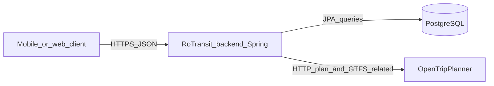

# RoTransit backend (black box)

This document describes the backend **as a component**: what it is for, what it depends on, and what it exposes over HTTP. It is not a runbook; for how to run the stack, ports, and OTP URL switching, see [backend-setup.md](../backend-setup.md).

## What this component is

The backend is RoTransit’s **JSON over HTTP** API. Clients (for example the Flutter app) send requests; the backend returns JSON and may read or write **PostgreSQL** or call **OpenTripPlanner (OTP)** on behalf of a given city.

It is implemented with **Spring Boot 3.3.x** on **Java 21** (`backend/pom.xml`). Main libraries:

- `spring-boot-starter-web` — REST controllers, JSON serialization
- `spring-boot-starter-data-jpa` — PostgreSQL access
- `spring-boot-starter-validation` — request validation (`@Valid`, query/path constraints)
- `spring-boot-starter-actuator` — operational endpoints (see below)
- PostgreSQL JDBC driver (runtime)

## Black-box view

| Aspect | Description |
|--------|-------------|
| **Inputs** | HTTP methods, paths, query parameters, path variables, and JSON bodies where noted below. |
| **Outputs** | JSON response bodies shaped by DTO records under `backend/src/main/java/com/rotransit/backend/dto/`, plus standard HTTP status codes. Invalid input is handled by `ApiExceptionHandler` (`backend/src/main/java/com/rotransit/backend/controller/ApiExceptionHandler.java`). |
| **Persistence** | **PostgreSQL**: cities, saved routes, and GTFS-backed catalog data (via services such as `GtfsReadService`). Schema is not auto-created by Hibernate (`ddl-auto: none` in `application.yml`). |
| **External routing engine** | **OTP** is not embedded. The backend calls OTP over HTTP using `RestTemplate` (`OtpHttpClient`). Each row in `cities` includes an `otp_base_url` (`City` entity) pointing at that city’s OTP instance (for example `http://otp:8080/otp` in Docker vs `http://localhost:8080/otp` when the backend runs on the host). |

There is no published OpenAPI/Swagger spec in this repository; the **contract** is the Java DTOs and controller signatures.

### Default HTTP port

The API listens on **8085** by default (`server.port` in `backend/src/main/resources/application.yml`, overridable via `PORT` / `SERVER_PORT`).

### Actuator vs app health

- **App liveness**: `GET /api/health` returns `{"status":"ok"}`.
- **Spring Boot Actuator**: `management.endpoints.web.exposure.include` exposes `health` and `info` under the actuator base path (typically `/actuator/health`, `/actuator/info`), which is separate from `/api/health`.

## Architecture (high level)

## External configuration

- **Database**: `DB_URL`, `DB_USER`, `DB_PASSWORD` (see `application.yml` for defaults).
- **OTP**: Per-city `otp_base_url` in the database, not a single global env var in the Spring config.

## HTTP API inventory

Path prefix note: **`GET /api/routes/search`** (itinerary search via OTP) lives on `RouteController` under `/api`, while **saved routes** use **`/api/routes/save`**, **`/api/routes/saved`**, etc. on `SavedRouteController`. Spring routes them by path segments (`search` vs `save` / `saved`); there is no conflict.

| Area | Method | Path | Inputs (summary) | Response (DTO / shape) |
|------|--------|------|-------------------|-------------------------|
| Health | GET | `/api/health` | — | `{"status":"ok"}` |
| Cities | GET | `/api/cities` | — | JSON array of `CityResponse`: `id` (UUID), `name`, `country` |
| Routing | GET | `/api/routes/search` | `cityId` (UUID), `origin`, `destination`, `serviceDate` (ISO date), `serviceTime` (ISO time), optional `passengerCount` (1–10, default 1), `offset`, `limit` | `RouteSearchResponse`: `cityId`, `cityName`, `offset`, `limit`, `total`, `routes` (list of `RouteOptionResponse`: duration, transfers, walk distance, estimated price, fare rule text, `legs` with geometry/stops as in `LegResponse`) |
| Stops | GET | `/api/stops/nearby` | `cityId`, `lat`, `lon`, optional `radiusMeters` (50–5000, default 500) | List of `NearbyStopResponse`: `stopId`, `name`, `lat`, `lon` |
| Stops | GET | `/api/stops/search` | `cityId`, `q`, optional `limit` (1–20), optional `refLat` + `refLon` | List of `NearbyStopResponse` |
| Stops | GET | `/api/stops/resolve-for-route` | `cityId`, `origin`, `stopName`, `serviceDate`, `serviceTime` | Single `NearbyStopResponse` (disambiguates a rider-facing stop name using OTP) |
| Buses | GET | `/api/buses` | `cityId` | List of `BusLineResponse` |
| Buses | GET | `/api/buses/{routeId}/stops` | Path `routeId`, `cityId`, optional `directionId` | List of `RouteStopResponse` |
| Buses | GET | `/api/buses/{routeId}/timetable` | Path `routeId`, `cityId`, `stopId`, `serviceDate`, optional `directionId` | `StopTimetableResponse`: `cityId`, `routeId`, `stopId`, `serviceDate`, `departures` (list of `StopTimetableEntryResponse`) |
| Saved routes | POST | `/api/routes/save` | JSON body: `SaveRouteRequest` — `deviceUserId`, `cityId`, optional `label`, `routeMetadata` | **201** `SavedRouteResponse`: `id`, `cityId`, `cityName`, `label`, `routeMetadata`, `createdAt` |
| Saved routes | GET | `/api/routes/saved` | `deviceUserId`, optional `cityId` | List of `SavedRouteResponse` |
| Saved routes | DELETE | `/api/routes/saved/{routeId}` | Path `routeId`, `deviceUserId` | **204** empty body |
| Saved routes | GET | `/api/routes/saved/{routeId}/validate` | Path `routeId`, `deviceUserId`, `serviceDate`, `serviceTime` | `SavedRouteValidationResponse`: `isValid`, `reason` |

## Related documentation

- [backend-setup.md](../backend-setup.md) — prerequisites, Maven wrapper, Docker, health checks, OTP host alignment.
- [backend-flow.md](../backend-flow.md) — example layered flow for defining an endpoint (`GET /api/cities`).
